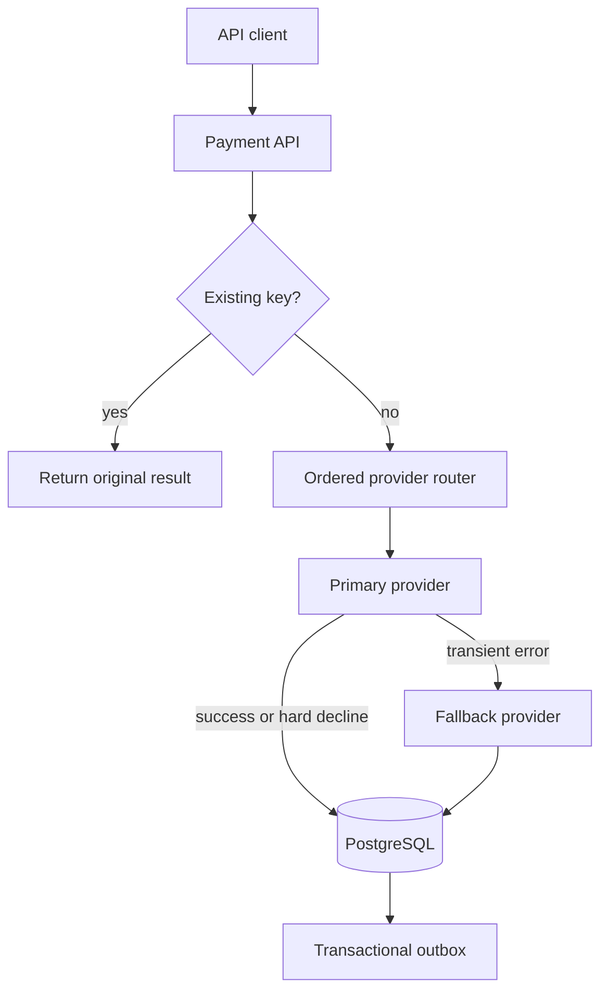

# Architecture decisions

## Request flow

## ADR-001: Idempotency is a database invariant

`Idempotency-Key` has a unique constraint. Application lookup makes normal retries cheap; the constraint remains the final guard against concurrent duplicate requests.

## ADR-002: Provider fallback is ordered

Only transient errors and soft declines may advance to another provider. Hard declines stop immediately, preventing repeated authorization attempts and customer confusion.

## ADR-003: Domain state and events commit together

The payment update and outbox row share one transaction. A publisher can later forward unpublished rows to Kafka without losing an event between database commit and broker publish.

## Production extensions

- Persist request fingerprints and reject key reuse with a different body.
- Lease outbox rows using `FOR UPDATE SKIP LOCKED`, publish to Kafka, then mark published.
- Replace demo providers with isolated HTTP clients using timeouts, circuit breakers, and signed requests.
- Encrypt provider tokens and minimize PCI scope through hosted fields/tokenization.
- Add retry scheduling with exponential backoff, jitter, and a terminal dead-letter path.
