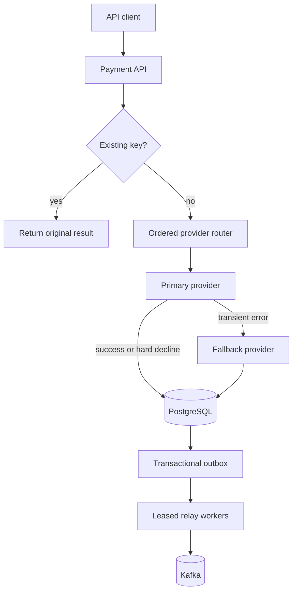

# Architecture decisions

## Request flow

## ADR-001: Idempotency is a database invariant

`Idempotency-Key` has a unique constraint. Each row also stores a SHA-256 fingerprint over canonical merchant, amount, and currency inputs. Exact retries return the original result; reuse with different charge-defining data returns HTTP 409. The database constraint remains the final guard against concurrent duplicate requests.

## ADR-002: Provider fallback is ordered

Only transient errors and soft declines may advance to another provider. Hard declines stop immediately, preventing repeated authorization attempts and customer confusion.

## ADR-003: Domain state and events commit together

The payment update and outbox row share one transaction. Relay workers lock small batches using `FOR UPDATE SKIP LOCKED`, publish them to Kafka, and mark them published in the same relay transaction. A broker failure rolls the transaction back so the row is retried. Delivery is at least once, so consumers must deduplicate by event identity.

## ADR-004: Webhooks are authenticated and replay-safe

The service verifies an HMAC-SHA256 signature over the untouched request body using constant-time comparison. It stores the provider event before applying state and enforces uniqueness on `(provider, event ID)`. Provider retries therefore return success without repeating the state transition.

## ADR-005: Retries are durable work, not sleeping threads

Exhausted transient provider attempts create a PostgreSQL retry row with capped exponential backoff and deterministic jitter. Workers lease due rows with `SKIP LOCKED`, so multiple instances can process concurrently without duplicate leases. Success or a hard decline terminates retrying; reaching the configured limit creates a terminal failure event.

## ADR-006: Operational signals reflect business outcomes

Prometheus counters expose created payments, idempotent replays, provider outcomes, and final payment states. Provider latency uses histograms suitable for p95/p99 alerts. Correlation IDs are accepted only from a bounded safe character set, returned to clients, and placed in logging context for cross-service investigation.

## ADR-007: Provider failures are isolated locally

Each provider has an independent consecutive-failure circuit. Only transient infrastructure outcomes contribute to opening it; customer and business declines do not. Open circuits are bypassed so the ordered fallback chain can continue without spending latency budget on a known unhealthy dependency. After the cool-down, one half-open probe decides whether to close or reopen the circuit. This intentionally favors fast per-instance protection; a production deployment can aggregate provider-health alerts without introducing a shared store into the synchronous payment path.

## Production extensions

- Persist request fingerprints and reject key reuse with a different body.
- Lease outbox rows using `FOR UPDATE SKIP LOCKED`, publish to Kafka, then mark published.
- Replace demo providers with isolated HTTP clients using timeouts, circuit breakers, and signed requests.
- Encrypt provider tokens and minimize PCI scope through hosted fields/tokenization.
- Add retry scheduling with exponential backoff, jitter, and a terminal dead-letter path.

## Verification strategy

Fast unit tests cover routing, failure classification, retry policy, metrics, and cryptographic verification. Testcontainers starts PostgreSQL 16 in CI to apply every Flyway migration and exercise database-specific behavior including partial indexes, uniqueness constraints, and `FOR UPDATE SKIP LOCKED` leasing.

Flyway V5 aligns the legacy fixed-width currency column with the JPA `VARCHAR(3)` contract, keeping Hibernate schema validation enabled as a deployment gate.
